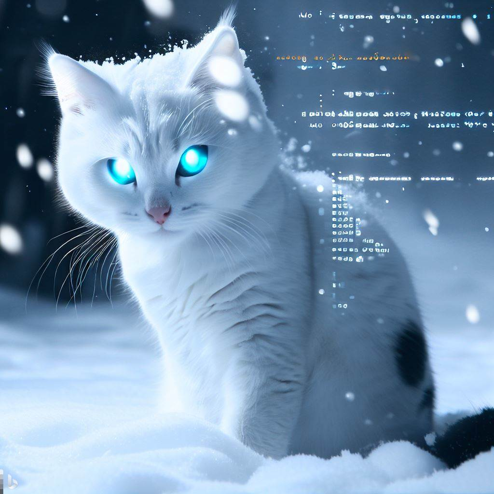

# From coffee to code—fuelling my passion. 🐈

Hi, I'm Eddie Chang, a frontend engineer who loves cats, traveling, and literature. I create user-friendly websites and find inspiration in exploring new cultures and immersing myself in books. Let's connect and chat about frontend development, travel, or our shared love for cats!
# Introduction

- 💻 Front-end engineer with a curiosity for backend development.
- 🚀 Front-end developer with a growing fascination for the backend world.
- 🌟 Embarking on a front-end development career while exploring the realm of backend possibilities.
- ⚡️ Enthusiastic about front-end development and captivated by the mysteries of the backend.
- 🌍 Travel enthusiast, eager to explore experience.
- 📫 How to reach me: eddie605134@gmail.com

# Tech Stack
## Programming Languages

## Front-End Skills

## Back-End Skills

## Integrated Development Environment (IDE)

## Version Control

## Database

## API Tool

## Design Tool

## Cloud Native

# Most Used Languages

# GitHub Stats

<!--
**Hans-Tsai/Hans-Tsai** is a ✨ _special_ ✨ repository because its `README.md` (this file) appears on your GitHub profile.

Here are some ideas to get you started:

- 🔭 I’m currently study at NCCU MIS.
- 🌱 I’m currently learning Node.js & Java & Docker.
- 👯 I’m looking to collaborate on javascript
- 🤔 I’m looking for help with Node.js
- 💬 Ask me about 
- 📫 How to reach me: lgs840522@gmail.com
- 😄 Pronouns: ...
- ⚡ Fun fact: ...
-->

<!-- 
參考文章:
- [如何建立獨一無二的 GitHub Profile！與三個很酷的設計及應用](https://medium.com/starbugs/%E5%A6%82%E4%BD%95%E5%BB%BA%E7%AB%8B%E7%8D%A8%E4%B8%80%E7%84%A1%E4%BA%8C%E7%9A%84-github-profile-%E8%88%87%E4%B8%89%E5%80%8B%E5%BE%88%E9%85%B7%E7%9A%84%E8%A8%AD%E8%A8%88%E5%8F%8A%E6%87%89%E7%94%A8-ef1cbb4b42c1)
- [設定 GitHub Profile 的 Background Color --- Managing your theme settings](https://docs.github.com/en/account-and-profile/setting-up-and-managing-your-personal-account-on-github/managing-personal-account-settings/managing-your-theme-settings)
-->
